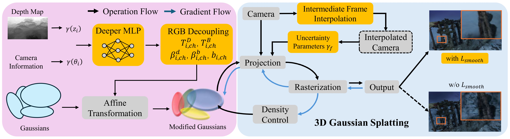

# RUSplatting: Robust 3D Gaussian Splatting for Sparse-View Underwater Scene Reconstruction

📄 [**Paper**](https://arxiv.org/abs/2505.15737) accepted by BMVC 2025
🌐 [**Project Page**](https://theflash987.github.io/RUSplatting.page/)

[](https://huggingface.co/datasets/theflash987/Submerged3D)
[](https://zenodo.org/records/15482420)




## 1. Configuration

- **Python Version**: *3.12.9*
- **CUDA Version**: *12.8* 
- **PyTorch Version**: *2.5.1*
- **Torchvision Version**: *0.20.1*
- **Torchaudio Version**: *2.5.1*
- **Graphics Card**: RTX 4090, 24GB

## 2. Setup

Please refer to the documentation `README.md` from the [3D Gaussian Splatting repo](https://github.com/graphdeco-inria/gaussian-splatting).

## 3. Dataset

- **Submerged3D**: Our newly collected dataset, it consists of four scenes, each containing 20 RGB 720p images focusing on shipwrecks captured in the deep sea.
  - Using our dataset via Hugging Face:
    ```python
    from datasets import load_dataset
    
    # Login using e.g. `huggingface-cli login` to access this dataset
    ds = load_dataset("theflash987/Submerged3D")
    ```
  - Or download the zip file directly from [Zenodo](https://zenodo.org/records/15482420).
- **Processing your own scene**:
  - Please refer to the [Processing your own scenes](https://github.com/graphdeco-inria/gaussian-splatting?tab=readme-ov-file#processing-your-own-scenes) section from 3D Guassian Splatting.
  - In order to train with the interpolated frames, the interpolated frames **must be** named with a `_to_` flag. For example: `frame001_to_frame002.jpg`.
  - The depth maps are generated from [Depth-Anything-V2](https://github.com/DepthAnything/Depth-Anything-V2).
    - **Note on Generating Depth Maps**: Since the depth info output by the Depth-Anything-V2 is opposite to what our model expects, add the following line before *line 63* in [run.py](https://github.com/DepthAnything/Depth-Anything-V2/blob/main/run.py) to flip the depth values:
      ```
      depth = 255.0 - depth
      ```
      and add the following flags:
      ```
      --pred-only --grayscale
      ```
  - The final structure of your own scene should be like this
    ```
    <your_dataset>
    |---depthmap
    |---distorted
    |---images
    |   |---<frame000>
    |   |---<frame000_to_frame001>
    |   |---<frame001>
    |   |---...
    |---input
    |---sparse
    |---stereo
    ```
  
  **Note on Frame Interpolation**: This work does not focus on the implementation of frame interpolation techniques. Any method capable of generating intermediate frames from consecutive frames can be used. In our implementation, we use [RIFE](https://github.com/hzwer/ECCV2022-RIFE) for frame interpolation. Since our training data has a resolution of 720p, we further employ [Real-ESRGAN](https://github.com/xinntao/Real-ESRGAN) for resolution enhancement to ensure consistency with the training data resolution. Similarly, as this work focuses on 3D Gaussian Splatting reconstruction, there are no restrictions on these techniques, any method that achieves the desired functionality can be selected. However, the quality of the interpolated frames and the subsequent resolution enhancement **does** have an impact on the final reconstruction quality.

## 4. Training Flags

### `--frame <value>`
- **Purpose**: Set a fixed weight for interpolated frames during training.
- **Type**: Float (e.g., 0.1, 0.5, 1.0)
- **Default**: None (uses default weight of 0.4)
- **Note**: This flag is ignored when `--adaptive` is used.

### `--adaptive`
- **Purpose**: Enable learnable uncertainty parameters for interpolated frame weights.
- **Type**: Boolean flag
- **Default**: False
- **Note**: 
  - Original frames: Fixed weight of 1.0.
  - Interpolated frames: Learnable weights updated during training.
  - Overrides `--frame` setting when both are specified.

### `--alpha <value>`  
- **Purpose**: Coefficient for the log uncertainty term in adaptive loss (experimental feature).
- **Type**: Float
- **Default**: None
- **Note**: Currently not actively used in loss calculation. To enable this feature:
  1. Uncomment **line 151** in [`train.py`](train.py): 
     ```python
     loss = (weight * loss) / 2 + (opt.alpha * log_uncertainty) / 2
     ```
  2. Comment out **line 152** in [`train.py`](train.py):
     ```python
     # loss = (weight * loss) / 2 + log_uncertainty / 2
     ```

### How to run

**Fixed interpolated frame weight:**
```bash
python train.py -s path/to/scene --frame 0.4 --alpha 0.1
```

**Adaptive interpolated frame weights:**
```bash
python train.py -s path/to/scene --adaptive
```

## 5. Recommend Work

We thank the authors of the following works for their excellent contributions:

- [3D Gaussian Splatting for Real-Time Radiance Field Rendering](https://arxiv.org/abs/2308.04079)

- [UW-GS: Distractor-Aware 3D Gaussian Splatting for Enhanced Underwater Scene Reconstruction](https://ieeexplore.ieee.org/abstract/document/10943785?casa_token=RXKIhV0c9x8AAAAA:WQS_9BCj2dmsPwWBEcHtqRa18_DxVwletzpoBQyQvnPMu_YLKlgdaPYC5CDc5F_YS0Ufuo9qdbU)

- [Real-Time Intermediate Flow Estimation for Video Frame Interpolation](https://arxiv.org/abs/2011.06294)

- [Real-ESRGAN: Training Real-World Blind Super-Resolution with Pure Synthetic Data](https://arxiv.org/abs/2107.10833)


- [Depth Anything V2](https://arxiv.org/abs/2406.09414)

## 6. Citation

If you think this project is helpful, please feel free to leave a star or cite our paper:

```bibtex
@inproceedings{jiang2025rusplatting,
  author    = {Zhuodong Jiang and Haoran Wang and Guoxi Huang and Brett Seymour and Nantheera Anantrasirichai},
  title     = {RUSplatting: Robust 3D Gaussian Splatting for Sparse-View Underwater Scene Reconstruction},
  booktitle = {Proceedings of the British Machine Vision Conference (BMVC)},
  year      = {2025}
}
```
